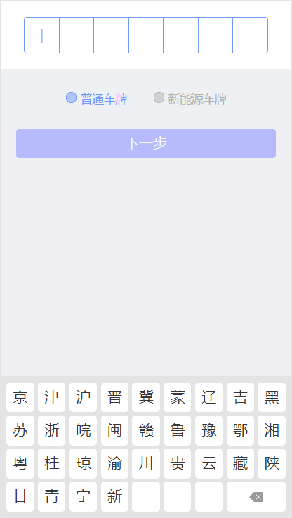

# 停车王车牌号码专用键盘 VehicleKeyboard - vue.js

- `JavaScript(Vue.js)` JavaScript(Vue.js)项目，为 H5 页面定制，包括 Web、微信、支付宝等，同样包括输入组件、键盘组件及相关控制逻辑实现



### 安装

- NPM

```
npm i vehicle-keyboard -S
```

- Script

```
<script src="path/dist/index.js"></script>
```

### 示例

Website at https://mvpleung.github.io/vehicle-keyboard-js/

### 键盘输入框混合组件使用说明

> 混合组件包括键盘和输入框两部分组件，具有完成的车牌输入逻辑。

```template
    <mixed-keyboard
		:args="{presetNumber, autoComplete: false}"
		:callbacks="{oncompleted, onkeypressed}">
	</mixed-keyboard>
```

### 单键盘组件使用说明

> 单键盘组件只包含键盘组件部分。

```template
    <single-keyboard
		:args="{presetNumber, autoComplete: false}"
		:callbacks="{oncompleted, onkeypressed}">
	</single-keyboard>
```

### 单键盘配置说明(args)

| Field            | Type      | Description                                                                                          |
| ---------------- | --------- | ---------------------------------------------------------------------------------------------------- |
| **presetNumber** | `String`  | `预设车牌号码。可以是空车牌号码或者完整车牌。注意：参数不可为空，当空车牌时，设置空字符串`           |
| **keyboardType** | `Number`  | `键盘类型[0:全键盘，1：民用, 2：民用+特殊车辆]`                                                      |
| **currentIndex** | `Number`  | `当前输入位置，默认为 0`                                                                             |
| **provinceName** | `String`  | `默认省份`                                                                                           |
| **numberType**   | `String`  | `用户预设车牌输入类型0：自动探测车牌类型，5:新能源车牌(engine.NUM_TYPES)`                            |
| **autoComplete** | `Boolean` | `是否自动完成，默认为true`                                                                           |
| **showConfirm**  | `Boolean` | `是否显示确认按钮，默认为true`                                                                       |
| **showKeyTips**  | `Boolean` | `是否显示按键提示框(点击按键弹出当前按键内容提示，类似输入法)`                                       |
| **align**        | `String`  | `按键对齐方式，取值范围 [center: 居中对齐，经典键盘模式(默认), justify: 两端对齐，位数不够补充空白]` |

### 混合键盘配置说明(args)

| Field               | Type      | Description                                                                                          |
| ------------------- | --------- | ---------------------------------------------------------------------------------------------------- |
| **presetNumber**    | `String`  | `预设车牌号码。可以是空车牌号码或者完整车牌。注意：参数不可为空，当空车牌时，设置空字符串`           |
| **keyboardType**    | `Number`  | `键盘类型[0:全键盘，1：民用, 2：民用+特殊车辆]`                                                      |
| **provinceName**    | `String`  | `默认省份`                                                                                           |
| **forceChangeMode** | `Boolean` | `是否强制切换键盘类型(忽略当前录入车牌有效性)`                                                       |
| **autoComplete**    | `Boolean` | `是否自动完成，默认为true`                                                                           |
| **showConfirm**     | `Boolean` | `是否显示确认按钮，默认为true`                                                                       |
| **showKeyTips**     | `Boolean` | `是否显示按键提示框(点击按键弹出当前按键内容提示，类似输入法)`                                       |
| **align**           | `String`  | `按键对齐方式，取值范围 [center: 居中对齐，经典键盘模式(默认), justify: 两端对齐，位数不够补充空白]` |
| **position**        | `String`  | `键盘展示位置，取值范围 [static: 默认, bottom: 底部]`                                                |

### 事件说明(callbacks)

| Event            | Params                           | Description                                                                 |
| ---------------- | -------------------------------- | --------------------------------------------------------------------------- |
| **onchanged**    | `presetNumber`,`isCompleted`     | `车牌变更`                                                                  |
| **onkeypressed** | `key`                            | `键位监听`                                                                  |
| **oncompleted**  | `presetNumber`,`isAutoCompleted` | `车牌输入完成，当 args.autoComplete 为 true 时，仅当点击 ‘确定’ 时，才调用` |
| **onmessage**    | `message`                        | `消息提示`                                                                  |

### 键盘逻辑引擎使用说明

[键盘逻辑引擎使用说明](./Engine.md)

### 车牌号码规则

1.  参见：[中国车牌号码编码规则全解](http://yoojia.xyz/2018/05/09/chinese-vehicle-number/)
2.  参见：[中华人民共和国民用机动车号牌](https://zh.wikipedia.org/wiki/中华人民共和国民用机动车号牌)

### 已知问题

- 在 Android4.4 以下的浏览器或者 WebView 中，由于不支持 CSS3 部分特性，会出现输入框界面宽度变化的问题；

### 版本更新记录

### v2018.0622

- 修复特殊车辆录入异常
- 增加普通车辆、新能源车辆切换限制
- 兼容桌面浏览器，兼容 IE9 及以上浏览器

### v2018.0621

- 增加键盘样式配置

### v2018.0620

- 增加大使馆车牌
- 全键盘增加确认按钮

### v2018.0620

- 增加大使馆车牌
- 全键盘增加确认按钮

### v2018.0619

- 修改基础尺寸单位为 rem

### License

    Copyright 2017 Xi'an iRain IOT Technology service CO., Ltd (ShenZhen)

    Licensed under the Apache License, Version 2.0 (the "License");
    you may not use this file except in compliance with the License.
    You may obtain a copy of the License at

    http://www.apache.org/licenses/LICENSE-2.0

    Unless required by applicable law or agreed to in writing, software
    distributed under the License is distributed on an "AS IS" BASIS,
    WITHOUT WARRANTIES OR CONDITIONS OF ANY KIND, either express or implied.
    See the License for the specific language governing permissions and
    limitations under the License.
